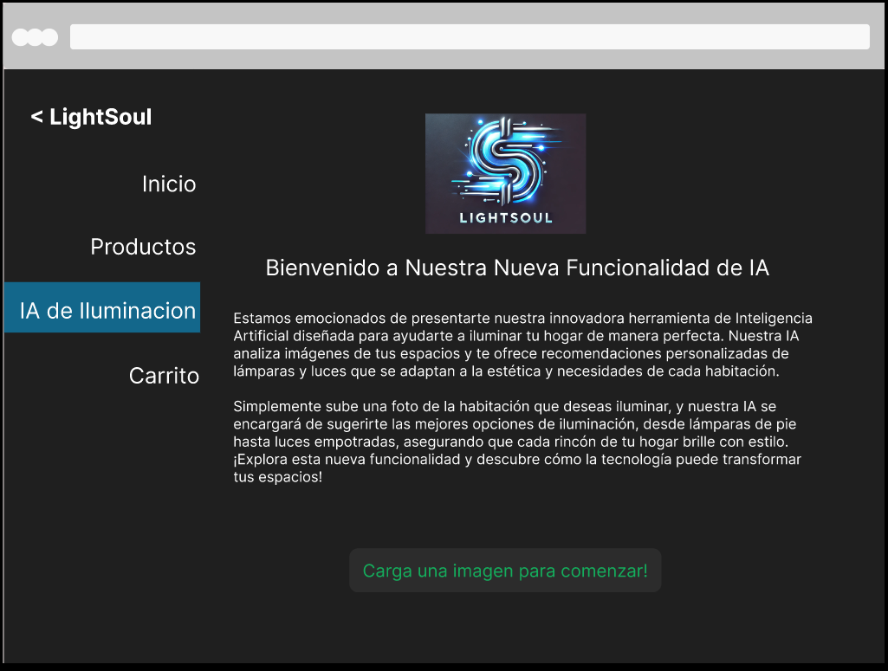
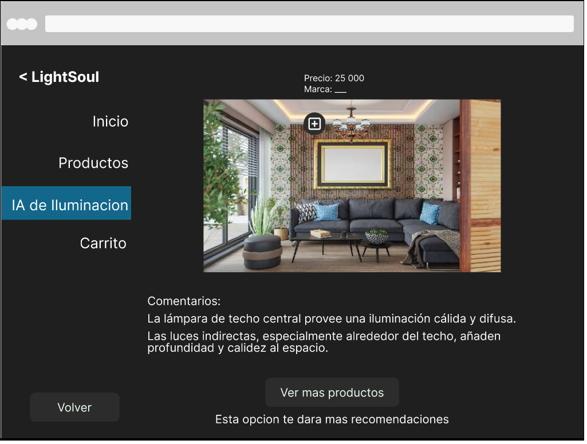
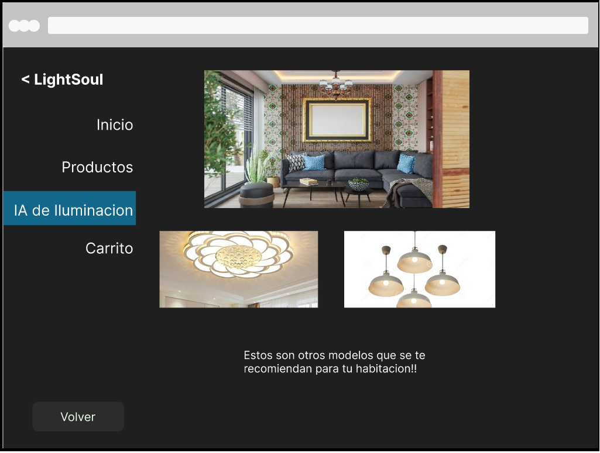
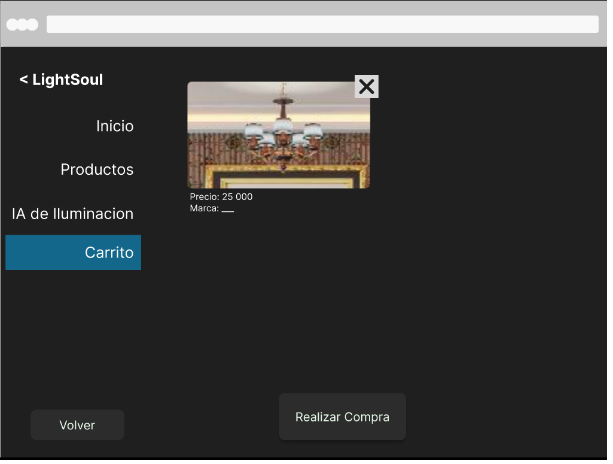

## Caso2Diseno

# Estudiantes:

- Calvo Rodriguez Kevin Yadir
- Kauffman Porcar Erick
- Robles Mata Jose Andres
- Urbina Salazar Luis Gerardo

# Diseño Interfaz:

- Pantalla IA

- Imagen generada por la IA

- Más productos

- Carrito de compra

# Pruebas:

Se uso maze.co para desarrollar todas las pruebas.
Se realizaron 4 pruebas diferentes para evaluar la funcionalidad de las pantallas.
Las pruebas eran:

1. Cargar Imagen

	Empieza en la pantalla "Pantalla IA"  y debe llegar a la pantalla "Imagen generada por IA". 
	Se le pide al usuario que encuentre donde cargar una imagen para usar la IA.

2. Descripción y Carrito

	Empieza en la pantalla "Imagen generada por IA" y debe llegar a la pantalla "Carrito de compra".
	Se le pide al usuario que agregue la lámpara sugerida por la IA al carrito. Debe pasar el mouse por encima de la lámpara para que la página muestre la información de la lámpara y la opción para agregar al carrito.
	
3. Regresar

	Empieza en la pantalla "Carrito de compra" y debe llegar a la pantalla "Imagen generada por IA". 
	El usuario debe presionar el botón para volver a la pantalla anterior.

4. Más productos

	Empieza en la pantalla "Imagen generada por IA" y debe llegar a la pantalla "Más productos".	
	El usuario debe pedirle al sistema que le muestre más opciones de lámparas para esa sala.

# Resultados:

